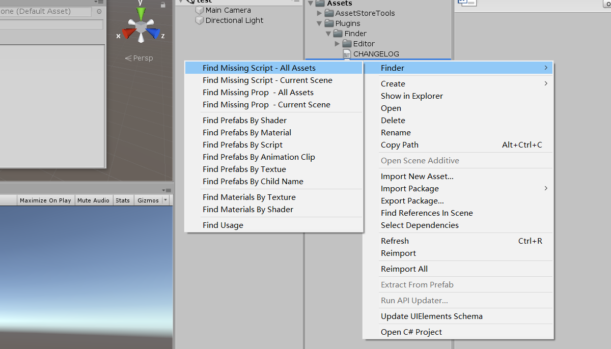

# Finder

[](https://github.com/litefeel/Unity-Finder/releases)
[](https://github.com/litefeel/Unity-Finder/blob/master/LICENSE.md)
[](https://paypal.me/litefeel)

Find Asset in Unity.


#### Shotscreen




#### Requirement

- Unity 2018.3+

#### Install

Find the manifest.json file in the Packages folder of your project and edit it to look like this:
``` js
{
  "dependencies": {
    "com.litefeel.finder": "https://github.com/litefeel/Unity-Finder.git",
    ...
  }
}
```


#### Support

* Create issues by issues page (https://github.com/litefeel/Unity-Finder/issues)
* Send email to me: litefeel@gmail.com
